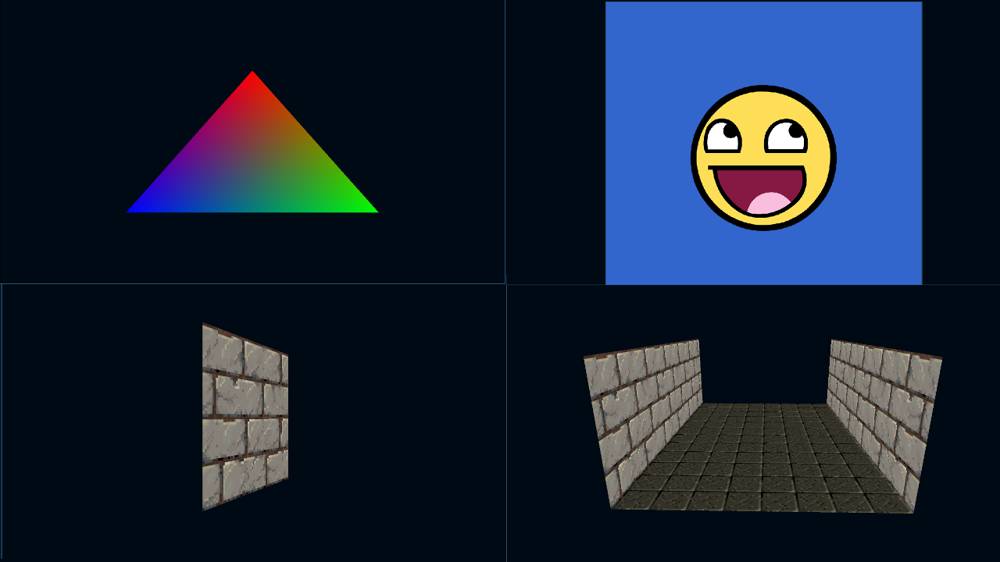

# Learn SOKOL

2. Clone the repo:
  ```
  git clone --recurse-submodules git@github.com:cartoonrepo/opengl_sokol.git
  ```

2. build the required static link libraries:
    ```
    cd opengl_sokol/sokol-odin/sokol

    # on Linux:
    ./build_clibs_linux.sh
    # on Windows with MSVC (from a 'Visual Studio Developer Command Prompt')
    build_clibs_windows.cmd
    # on macOS:
    ./build_clibs_macos.sh

    cd ../../
    ```

3. Build and run the samples:
  odin run /path_to_source -debug -collection:sokol=sokol-odin/sokol
  ```
  odin run src/1_4_hello_triangle -debug -collection:sokol=sokol-odin/sokol
  ```


